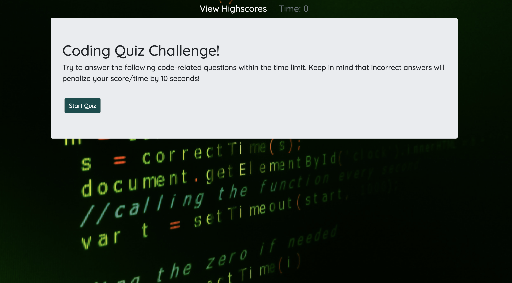
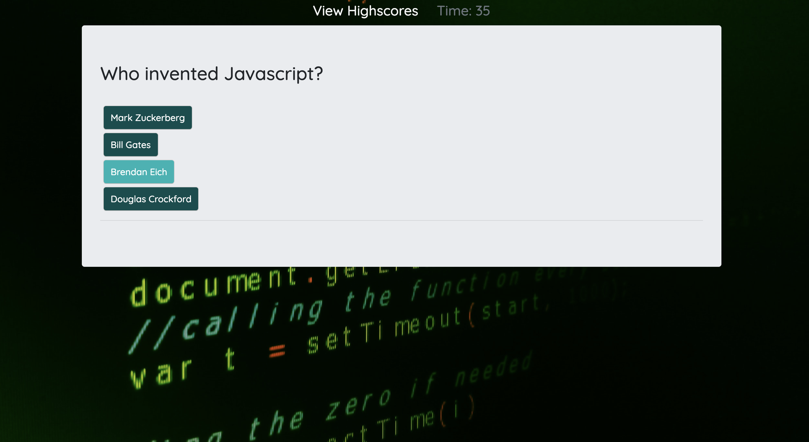

# Code Quiz

```
This is a timed quiz on JavaScript fundamentals that stores high scores.
```
## Required:
```
When the Start button is clicked:
* The timer starts and the user is presented with a question
* The user would have to choose the answer from the clickable buttons on the screen

When the user selects an answer:
* The user will be prompted whether the answer is correct or wrong
* If the user answers correctly, the user will be presented with another question
* If the user's guess is incorrect, 10 seconds will be subtracted from the time
* After a selection has been made, it will then move to the next question

When all questions are answered or the timer reaches 0:
* The game will end

When the game is over
* The user will be required to enter their initials
* The user can then click the Submit button to save the score
```
## Additional:
```
* Buttons are highlighted when hovering
* Wrong or Correct prompt disappears after a second
```



URL of deployed application:
https://xtineroq.github.io/code-quiz/
